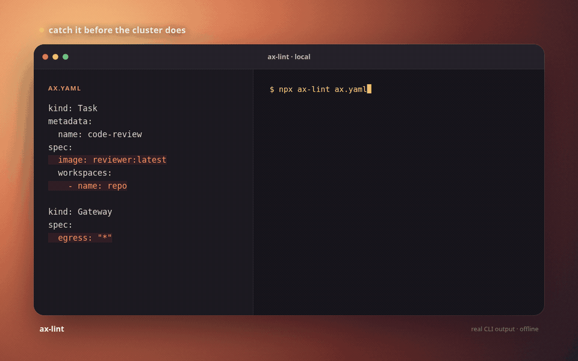

# ax-lint

> Catch broken and unsafe Google AX manifests before they reach your cluster.

[](https://www.npmjs.com/package/ax-lint) [](https://github.com/royalpinto007/ax-lint/actions/workflows/ci.yml) [](LICENSE)



## 30-second quickstart

```bash
npx ax-lint ax.yaml
```

```text
ax.yaml

✖ Task/code-review
  8:13  error    Workspace "repo" does not exist in atespace "default".  ax/invalid-reference

⚠ Gateway/default
  34:17  warning  Egress allows every host. Restrict hosts for production workloads.  ax/unrestricted-egress

1 error · 1 warning
```

`ax-lint` understands multi-document manifests, directories, and multiple files. It runs offline and does not require Go, Docker, Kubernetes, the AX CLI, a cluster, or network access.

```bash
ax-lint ax.yaml
ax-lint .
ax-lint manifests/*.yaml
ax-lint --strict ax.yaml
ax-lint --json ax.yaml
ax-lint --quiet ax.yaml
ax-lint --format github manifests/
```

## What it checks

Contract errors are definite incompatibilities with the pinned AX contract. They include malformed YAML, unknown fields, invalid types, unsupported resources, duplicate identities, broken workspace or gateway references, and invalid workspace bindings.

Policy warnings are configurable best practices. They cover wildcard egress, debug guest services, missing resource limits, mutable images, possible inline secrets, and suspicious workspace configuration. Suspected secret values are never printed.

See [Rules](docs/rules.md) for every rule, rationale, and AX reference.

## Configuration

Create `ax-lint.config.mjs` beside your manifests:

```js
export default {
  rules: {
    "ax/unrestricted-egress": "error",
    "ax/latest-image": "warning",
    "ax/debug-enabled": "off",
  },
};
```

Contract errors cannot be disabled. Policy rules accept `"error"`, `"warning"`, `"warn"`, or `"off"`.

Custom rules use the same located resource model:

```js
import { defineRule } from "ax-lint";

export default {
  customRules: [
    defineRule({
      name: "company/restricted-egress",
      defaultSeverity: "warning",
      description: "Require company-approved egress hosts.",
      check(resource, context) {
        // Inspect resource.value and report located diagnostics.
      },
    }),
  ],
};
```

## Programmatic API

```ts
import { lintAx } from "ax-lint";

const result = await lintAx("./ax.yaml");

console.log(result.errors);
console.log(result.warnings);
console.log(result.contract.commit);
```

Use `lintAxText(source, options, fileName)` for in-memory YAML. The complete API is documented in [API](docs/api.md).

## CI

GitHub Actions annotations place findings on their exact files and lines:

```yaml
- run: npx ax-lint --format github --strict manifests/
```

Exit codes are stable:

| Code | Meaning                                                      |
| ---- | ------------------------------------------------------------ |
| `0`  | No errors, or warnings without `--strict`                    |
| `1`  | Contract errors, policy errors, or warnings under `--strict` |
| `2`  | Invalid CLI usage, input, or configuration                   |
| `3`  | Reserved for unexpected internal failures                    |

## AX contract provenance

Version 0.0.1 supports `ax.io/v1alpha1` from Google AX commit [`d8ed0fe38bceb7842d3c47817d53d16ccdfcb601`](https://github.com/google/ax/commit/d8ed0fe38bceb7842d3c47817d53d16ccdfcb601).

```bash
ax-lint --version
# ax-lint 0.0.1 (AX ax.io/v1alpha1 d8ed0fe38bce)
```

The contract snapshot comes from the official protobuf, Go validation, manifest documentation, and examples. A maintainer-only drift check watches those sources. Runtime linting never fetches a schema.

Google AX is early and may change quickly. `ax-lint` fails closed on unsupported API versions instead of guessing. Tasks currently reference workspaces and gateways only, so `ax-lint` does not invent a Task to Model relationship.

## Development

Requires Node.js 20 or newer.

```bash
npm ci
npm run format:check
npm run lint
npm run typecheck
npm test
npm run test:coverage
npm run build
npm run check:package
```

See [Contributing](CONTRIBUTING.md), [Security](SECURITY.md), and [Changelog](CHANGELOG.md).

## License

MIT. Google AX is a separate Apache-2.0 project and is not bundled with this package.
